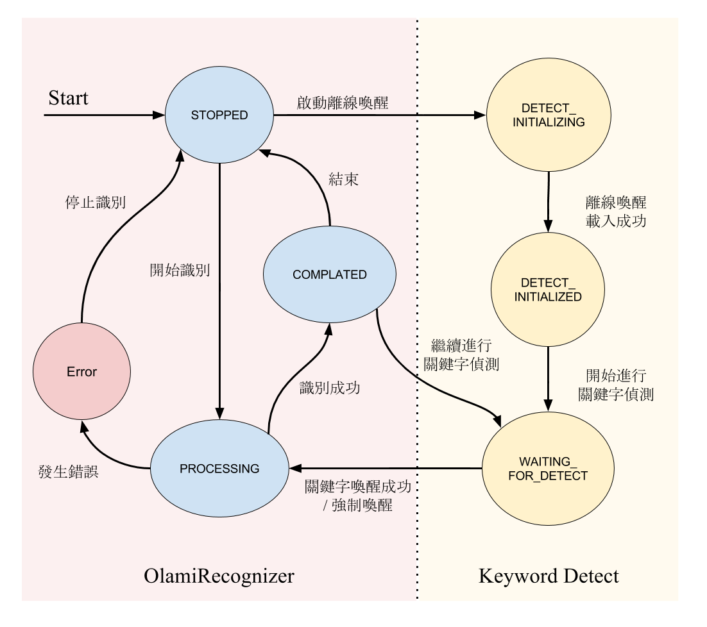
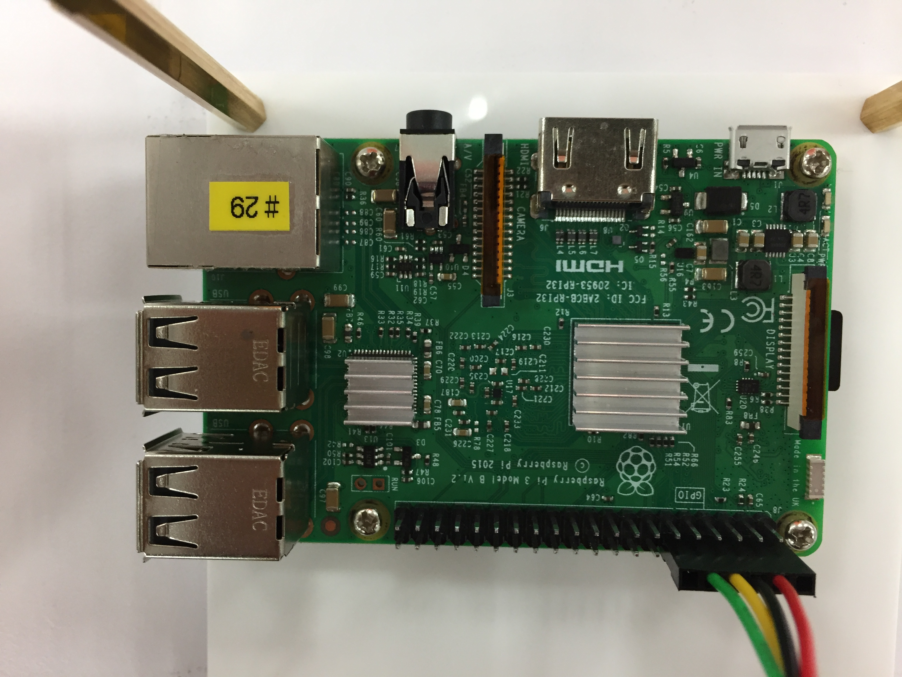
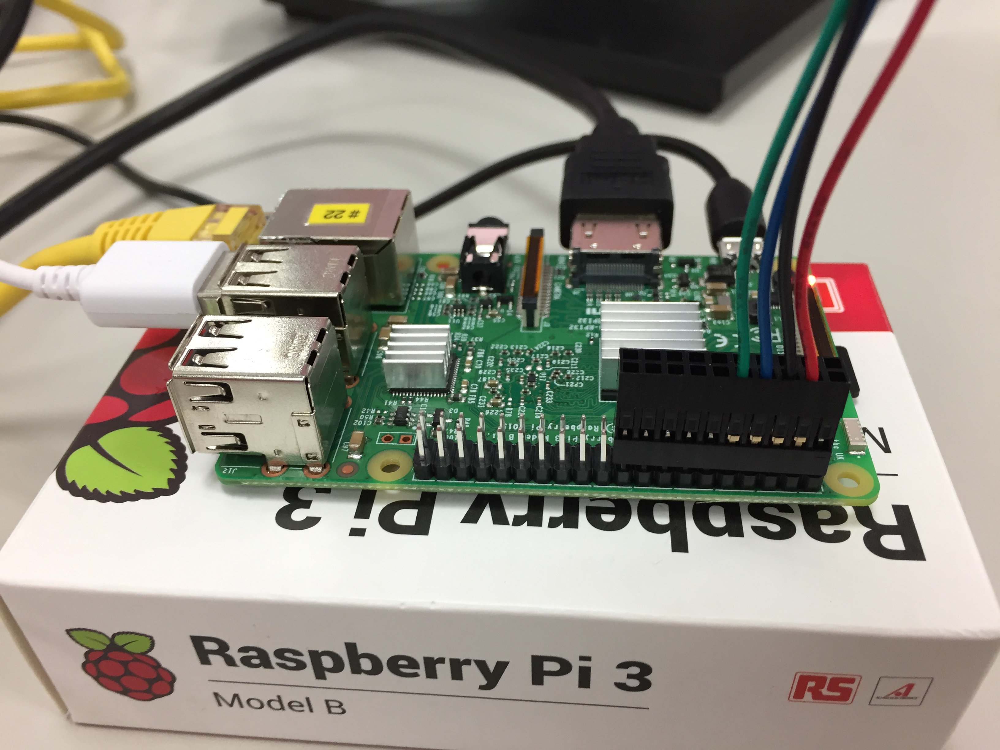
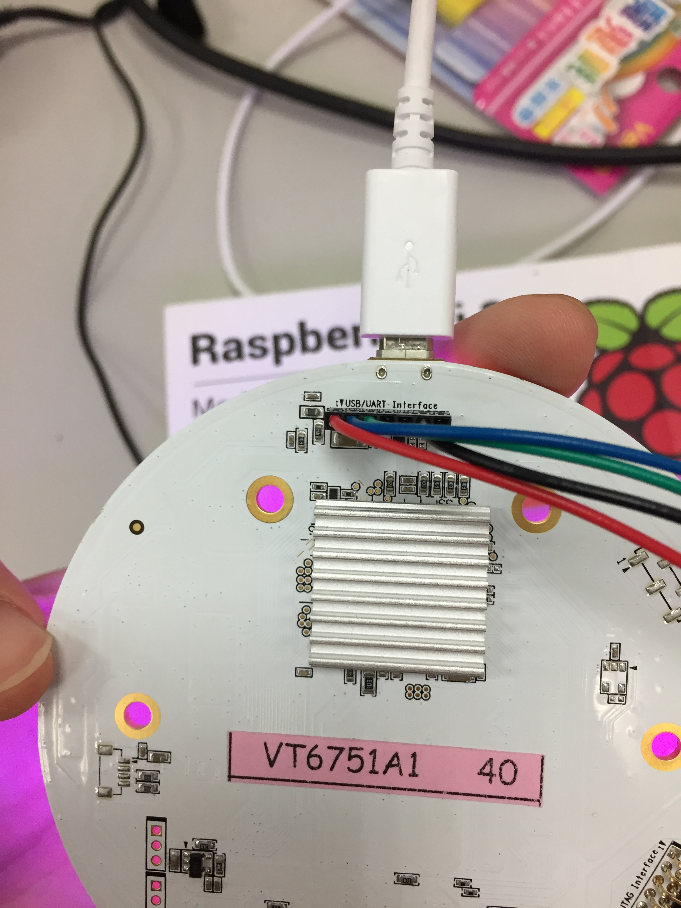

注意事項
--------------
*   Android things 相關操作請見Google說明文件：<https://developer.android.com/things/hardware/raspberrypi.html>
*   若需要使用離線喚醒的功能，必須要下載離線喚醒的相關檔案([點我下載](https://drive.google.com/drive/folders/0BzKhDssP3107SGxUMnpkWUZOQ3M?usp=sharing))，並放置在`/sdcard/musicbox/`目錄當中
*   若需要控制麥克風陣列板的話，必須要將樹梅派設定為application模式，相關操作請見Google說明文件：<https://developer.android.com/things/hardware/raspberrypi.html>
*   提供樹梅派Android things的映像檔：[點我下載](https://drive.google.com/file/d/0BzKhDssP3107b2hfSllmYTRIUUU/view?usp=sharing)
*   提供映像檔燒錄軟體(windows版本[點我下載](https://drive.google.com/file/d/0BzKhDssP3107WVkyQ3JiTkZvSWM/view?usp=sharing))，Linux可以透過dd來完成
*   注意！執行這個範例程式需要以下權限，Android things必須要是在Runtime時取得權限
```
<uses-permission android:name="android.permission.RECORD_AUDIO"/>
<uses-permission android:name="android.permission.WRITE_EXTERNAL_STORAGE"/>
<uses-permission android:name="android.permission.INTERNET" />
```


OlamiSpeechRecognizer 狀態機
--------------
OlamiSpeechRecognizer 狀態機如下圖所示：<br />
<br />


硬體裝置設定
--------------
注意，紅線要在樹梅派的右上角喔！<br />
<br />
如果是兩排的接線，紅線一樣要在樹梅派的右上角喔！<br />
<br />
麥克風板的部份，紅線必須要在麥克風板的右側，也就是pin 1的位置<br />
<br />
